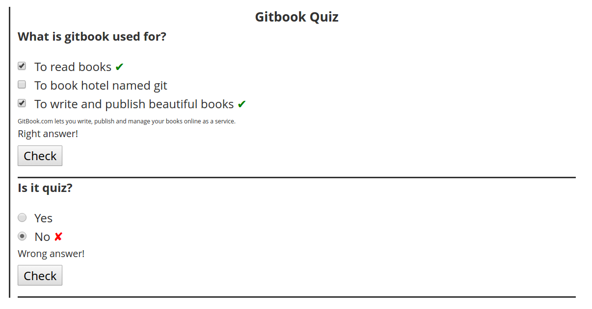

# gitbook-plugin-quiz
Allows to insert simple quizes into gitbook.



### How to use?

Add plugin to your `book.json`, then run `gitbook install`:

```
{
    plugins: ["quiz"]
}
```

It is possible to configure generic labels and text:

```
"pluginsConfig": {
    "quiz": {
            "labels": {
                "check"             : "Check my answers",
                "showExplanation"   : "Explain", 
                "showCorrect"       : "Show all",   
                "explanationHeader" : "Explanation"
            },
            "text": {
                "noChosen"    : "Choose at least one answer",  
                "incomplete"  : "Some correct answers are missing" 
            },
            "buttons": {
                "showCorrect"       : true, 
                "showExplanation"   : true 
            }
    }
}
```

Add quiz markup in your gitbook:

```
<quiz name="Gitbook Quiz">
    <question multiple>
        <p>What is gitbook used for?</p>
        <answer correct>To read books</answer>
        <answer>To book hotel named git</answer>
        <answer correct>To write and publish beautiful books</answer>
        <explanation>GitBook.com lets you write, publish and manage your books online as a service.</explanation>
    </question>
    <question>
        <p>Is it quiz?</p>
        <answer correct>Yes</answer>
        <answer>No</answer>
    </question>
    <question>
        <p>This is multiple dropdown quiz, in each dropdown select a correct number corresponding to the dropdown's order</p>
        <answer>
            <option correct>First</option>
            <option>Second</option>
            <option>Third</option>
            <option>Fourth</option>
        </answer>
        <answer>
            <option>First</option>
            <option correct>Second</option>
            <option>Third</option>
            <option>Fourth</option>
        </answer>
        <answer>
            <option>First</option>
            <option>Second</option>
            <option correct>Third</option>
            <option>Fourth</option>
        </answer>
        <answer>
            <option>First</option>
            <option>Second</option>
            <option>Third</option>
            <option correct>Fourth</option>
        </answer>
    </question>
</quiz>
```
