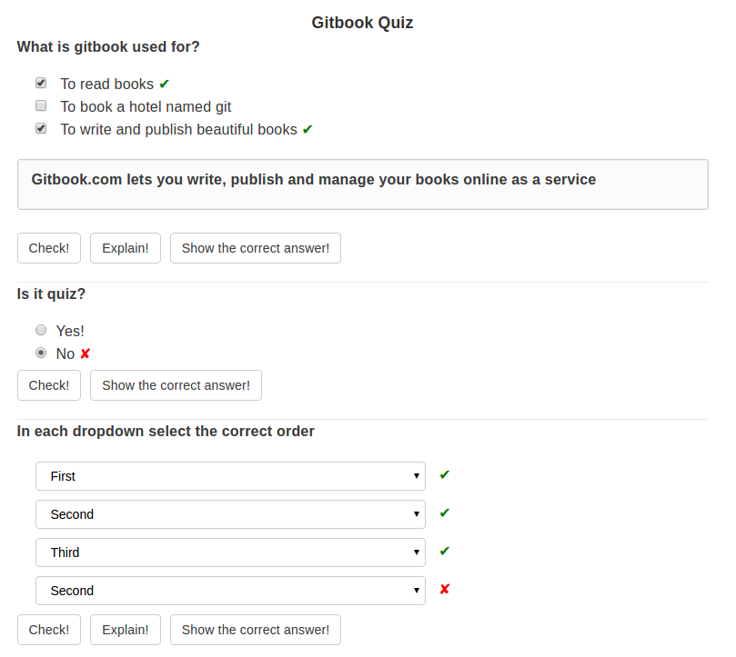

# gitbook-plugin-quiz
Allows to insert simple quizes into gitbook.



### How to use?

Add plugin to your `book.json`, then run `gitbook install`:

```
{
    plugins: ["quiz"]
}
```

It is possible to configure generic labels and text:

```
"pluginsConfig": {
    "quiz": {
        "labels": {
            "showCorrect"       : "",   // default is "Show correct answers"
            "check"             : "",   // default is "Check"
            "showExplanation"   : "",   // default is "Show explanation",
            "explanationHeader" : "Explanation" // default is ""
        },
        "text": {
            "noChosen"    : "",         // default is "No answer is chosen"
            "incomplete"  : ""          // default is "Some correct answers missing"
        },
        "buttons": {
            "showCorrect"       : true, // set to false to disable "show correct answers" button
            "showExplanation"   : true  // set to false to disable "show explanation" button
        }
    }
}
```

Add quiz markup in your gitbook:

```
<quiz name="Gitbook Quiz">
    <question multiple>
        <p>What is gitbook used for?</p>
        <answer correct>To read books</answer>
        <answer>To book hotel named git</answer>
        <answer correct>To write and publish beautiful books</answer>
        <explanation>GitBook.com lets you write, publish and manage your books online as a service.</explanation>
    </question>
    <question>
        <p>Is it quiz?</p>
        <answer correct>Yes</answer>
        <answer>No</answer>
    </question>
</quiz>
```
